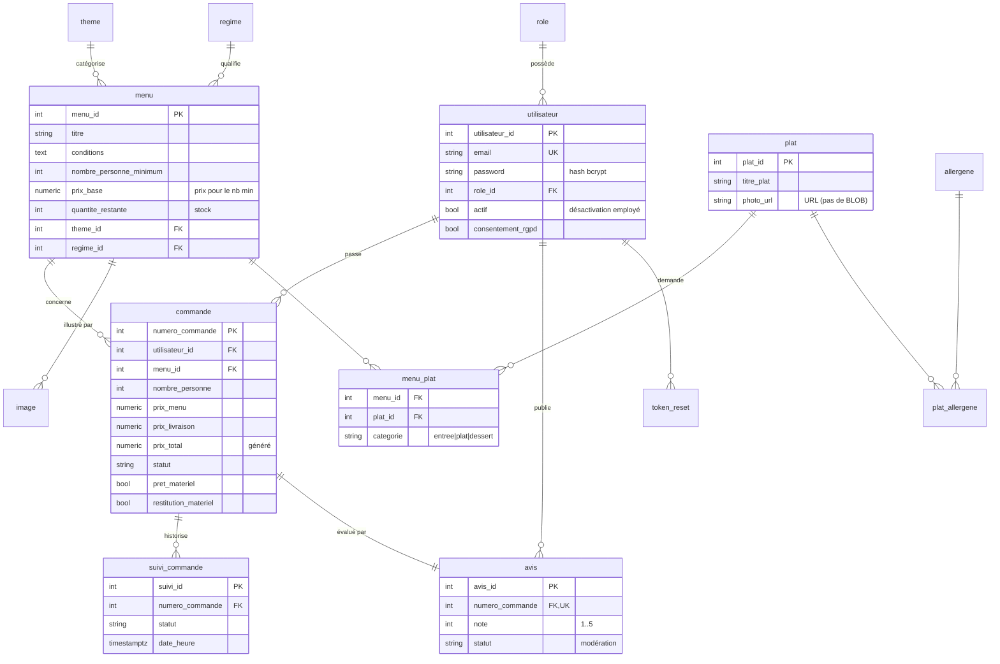

# Modèle de données — Vite & Gourmand

Base **relationnelle PostgreSQL**, créée et alimentée **en SQL brut** (`db/schema.sql`,
`db/seed.sql`) — sans ORM, sans migration ni fixture, conformément à l'énoncé.
Une seconde base **NoSQL (MongoDB)** servira uniquement la couche **statistiques admin**
(nombre de commandes par menu, chiffre d'affaires) — voir Phase 5.

## Diagramme entité-association

## Corrections apportées au MCD de départ

Le MCD fourni était volontairement imparfait. Améliorations (chacune défendable à l'oral) :

| # | Problème du MCD | Décision |
|---|-----------------|----------|
| 1 | `regime` présent comme **champ** de `menu` ET comme **table** | On garde la **table** `regime` + FK ; champ redondant supprimé. |
| 2 | `prix_par_personne` ambigu vs « prix pour le nb minimum » | `prix_base` = prix pour le **nombre minimum** ; prix unitaire = `prix_base / nombre_personne_minimum`. |
| 3 | Galerie d'images absente (`photo` seulement sur `plat`) | Table **`image`** (1 menu → N images) + texte `alt` pour le RGAA. |
| 4 | `conditions` du menu absentes | Champ **`conditions`** (TEXT) ajouté sur `menu`. |
| 5 | Plat ↔ menu non modélisé en N-N | Table **`menu_plat`** (N-N) + colonne **`categorie`** (entrée/plat/dessert). |
| 6 | Historique des statuts absent | Table **`suivi_commande`** (statut + horodatage). |
| 7 | Motif d'annulation absent | Champs `annulation_motif`, `annulation_mode_contact`, `annulation_date` sur `commande`. |
| 8 | Reset mot de passe non prévu | Table **`token_reset`** (hash du token, expiration, usage unique). |
| 9 | Messages de contact absents | Table **`contact`**. |
| 10 | Faute `restition_materiel` | Corrigé en `restitution_materiel`. |
| 11 | Désactivation de compte impossible | Champ **`actif`** sur `utilisateur`. |
| + | `photo` en **BLOB** sur `plat` | Remplacé par **`photo_url`** (URL) : stockage fichier, meilleures perfs/coût. |

## Choix techniques notables

- **`NUMERIC(10,2)` pour la monnaie** (jamais `FLOAT`) : évite les erreurs d'arrondi.
- **`TIMESTAMPTZ`** partout : horodatages avec fuseau.
- **Contraintes `CHECK`** : statuts, note 1–5, catégories, quantités ≥ 0 — fiabilité au niveau base.
- **`prix_total` = colonne générée** (`GENERATED ALWAYS AS … STORED`) : cohérence garantie (total = menu + livraison).
- **Index** sur clés étrangères et colonnes filtrées (`menu.prix_base`, `commande.statut`, `avis.statut`).
- **Mots de passe** : seul le **hash bcrypt** est stocké. Pour les tokens de reset, on stocke le **hash du token**, pas le token brut.
- **Rôle unique par utilisateur** (FK `role_id`) : un compte est soit utilisateur, soit employé, soit admin — pas de cumul dans ce domaine.

## Règles de gestion sur le prix (calculées applicativement)

- Prix unitaire = `prix_base / nombre_personne_minimum`.
- `prix_menu` = prix unitaire × `nombre_personne`.
- **Réduction de 10 %** si `nombre_personne ≥ nombre_personne_minimum + 5`.
- **Livraison** = 5 € de base, **+ 0,59 €/km** si la ville de prestation n'est pas Bordeaux (0 km sinon).
- `prix_total` = `prix_menu` + `prix_livraison` (recalculé en base).

## Cycle de vie d'une commande

`en_attente` → `accepte` → `en_preparation` → `en_cours_livraison` → `livre`
→ (`attente_retour_materiel` si matériel prêté) → `terminee`. État `annulee` possible
tant que la commande n'est pas `accepte`. Chaque transition est tracée dans `suivi_commande`.

## Vérification

`pnpm db:verify` exécute `schema.sql` puis `seed.sql` sur un PostgreSQL en mémoire
(PGlite) et lance des requêtes de contrôle (comptages, jointures, calcul du prix total,
historique de statuts).
